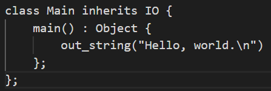
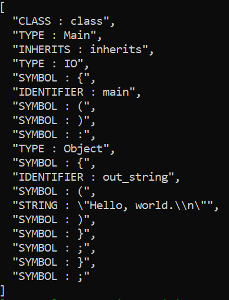

# Compilador da Linguagem Cool

## Configuração

- Após clonar o repositório rodar o comando `yarn` para instalar as dependências.

- Rodar o comando `yarn start` para iniciar o programa.

## Analisador Léxico

O Analisador Léxico se encontra na pasta `src/lexer` no arquivo `tokens.ts` onde estão definidos todos os tokens que fazem parte da linguagem Cool.

Utilizando a ferramenta [Lexer](https://github.com/aaditmshah/lexer), o analisador recebe como entrada um dos arquivos `.cl` localizados na pasta `src/cool_files`, contendo um programa escrito na linguagem Cool, e o transformando em uma string. Esta longa string por sua vez é analisada utilizando Regex para que os tokens possam ser identificados.

Abaixo segue um exemplo de um programa em Cool e o resultado retornado pelo analisador:

| Exemplo de Programa                                               | Exemplo de Saída                                   |
| ----------------------------------------------------------------- | -------------------------------------------------- |
|  |  |
